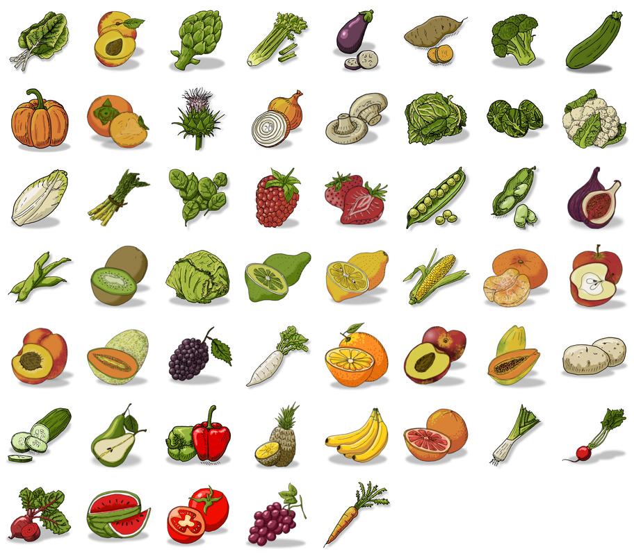

# Ilustraciones de Frutas y Verduras

Ilustraciones para el proyecto Journey of Food de Visualizar'17 de Medialab Prado.

## Contenido del repositorio:

- **Paleta de color**: Formato GPL para usar en Gimp, Krita, Inkscape, Mypaint y Web [journey-of-food_colors.gpl](journey-of-food_colors.gpl).
- **scans.pdf**: lustraciones dibujadas a mano por [Hannah Williams](http://WWW.hannahwilliams.co.za) y [Sofía Prosper](http://www.sofipros.com) y escaneadas.
- **orig**: Ilustraciones separadas y preparadas con [Gimp](http://www.gimp.org) para su tratamiento posterior.
- **svg**: Ilustraciones vectorizadas con [Inkscape](http://www.inkscape.org).
- **to-web**: Ilustraciones optimizadas para el uso final en la web.
- **color**: Ilustraciones coloreadas por [Alejandro Zappala](http://www.alejandrozappala.com), [Hannah Williams](http://WWW.hannawilliams.co.za) , [jEsuSdA](http://www.jesusda.com) y Pau Valiente con [Gimp](http://www.gimp.org).
- **render.sh**: script que convierte los gráficos vectoriales a formato PNG para proceder a su coloreado.
- **montage.sh**: script que genera una imagen con todas las imágenes a color.
- **to-web.sh**: script que genera y optimiza las imágenes para su uso en la web.
---

---

Licenciados bajo [Crative Commons By-Share alike](http://http://creativecommons.org/licenses/by-sa/4.0/)

